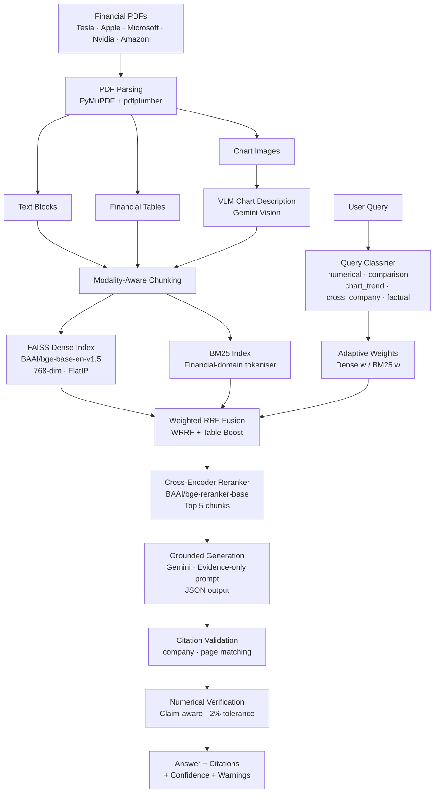

# Financial Document Intelligence — Multimodal RAG

An evidence-grounded financial document question-answering system that extracts answers from text, tables, and chart descriptions across SEC 10-K filings, with every numerical claim verified against retrieved evidence.

---

## Overview

Annual reports and 10-K filings are among the most information-dense documents analysts work with — a single filing can span 150–200 pages of narrative text, financial statements, footnotes, and embedded charts. Standard keyword search fails because financial questions often require combining evidence from multiple modalities: a revenue figure lives in a table, the explanation lives in surrounding prose, and the trend lives in a chart.

This system addresses the problem through a multi-stage retrieval pipeline that indexes text, tables, and chart descriptions separately, fuses dense semantic search with BM25 lexical retrieval using query-adaptive weights, and grounds every answer in retrieved evidence with post-generation numerical verification. Users can ask factual, numerical, comparison, trend, and cross-company questions in plain English.

---

## Key Features

- **Multimodal document ingestion** — extracts text blocks, financial tables, and chart/figure regions from PDFs using PyMuPDF and pdfplumber
- **Modality-aware chunking** — text chunks use heading-aware semantic splitting; tables are preserved whole with a pipe-delimited markdown representation; chart chunks are structured VLM descriptions
- **Dual FAISS indexes** — separate text-only and multimodal indexes allow fair ablation comparison across modalities
- **Financial-domain BM25** — custom tokeniser that canonicalises financial expressions (`$4.2 billion` = `$4.2B` = `$4.2bn` → `$4.2b`) for reliable lexical matching on exact figures, ticker symbols, and fiscal period labels
- **Weighted Reciprocal Rank Fusion (WRRF)** — fuses dense and BM25 ranked lists using weights derived from query type rather than raw score averaging, which is unreliable across incomparable score scales
- **Rule-based query classification** — classifies queries as `numerical`, `comparison`, `chart_trend`, `cross_company`, or `factual` and adjusts retrieval weights accordingly (e.g., `numerical` → Dense 30% / BM25 70%)
- **Table-aware retrieval boost** — small additive WRRF bonus for table chunks on numerical and comparison queries, counteracting dense retrievers' tendency to rank sparse tabular content below prose
- **Genuinely per-company cross-company retrieval** — for queries spanning multiple companies, each named company's chunks are fetched from the full index independently, guaranteeing representation before WRRF fusion
- **Cross-encoder reranking** — `BAAI/bge-reranker-base` scores (query, passage) pairs jointly, significantly improving final evidence ranking over bi-encoder retrieval alone
- **Evidence-grounded generation** — Gemini LLM answers only from retrieved evidence chunks via a strict system prompt; responds in structured JSON with answer, citations, confidence, and abstention flag
- **Citation validation** — generated citations are checked against retrieved `(company, page)` pairs to prevent hallucinated metadata
- **Claim-aware numerical verification** — every number in the answer is matched against evidence values using both numerical proximity (2% tolerance) and metric-keyword context overlap to prevent cross-metric false positives (e.g., `$25B revenue` not verified against `$25B net income`)
- **Parenthesised negative support** — correctly extracts `(9%)` and `($1.2B)` financial table notation as negative values
- **Abstention** — the LLM explicitly abstains when retrieved evidence is insufficient, returning a structured abstained flag rather than hallucinating
- **Retrieval debug panel** — UI toggle exposing query type, retrieval weights, candidate counts, chunk-type distribution, and company distribution per query
- **Retrieval tracing** — `retrieve_with_trace()` method returns per-chunk ranks at each pipeline stage (dense, BM25, WRRF, post-boost) for debugging
- **Structured evaluation framework** — 65-query benchmark with Recall@K, MRR, NDCG@K, faithfulness, answer correctness, citation accuracy, abstention accuracy, and a five-configuration retrieval ablation study

---

## System Architecture



---

## Technical Implementation

### Document Processing

PDFs are parsed with two libraries used together: pdfplumber handles table extraction (better at merged cells and complex layouts), and PyMuPDF handles text block extraction and image region detection. For each page, table bounding boxes are identified first, and text extraction skips those regions to avoid duplication. Chart/figure regions are detected by image area (≥ 2% of page area) and rasterised at 150 DPI for VLM processing. Each extracted element carries provenance metadata: company, document name, year, page number, and detected section heading.

### Embeddings & Vector Search

Text content is embedded using `BAAI/bge-base-en-v1.5` (768-dimensional), a BGE bi-encoder model that requires a query instruction prefix at search time but not at indexing time. Vectors are stored in a FAISS `IndexFlatIP` (exact inner product search on L2-normalised vectors, equivalent to cosine similarity). Two separate indexes are built during ingestion: a text-only index for baseline comparison and a multimodal index containing text, table, and chart chunks.

### Hybrid Retrieval

Dense retrieval captures semantic similarity, which is useful for factual and trend questions. BM25 captures exact financial identifiers — dollar amounts, fiscal year labels like `FY2023`, acronyms like `EBITDA` — that semantic embeddings can miss. The two ranked lists are combined using Weighted Reciprocal Rank Fusion:

```
WRRF(d) = w_dense / (k + rank_dense(d)) + w_bm25 / (k + rank_bm25(d))
```

RRF is used instead of score averaging because FAISS returns cosine similarities (bounded 0–1) while BM25 returns unbounded term-frequency scores — normalising and averaging these is unreliable. RRF operates on ranks, making it robust to scale differences.

### Query Classification

A rule-based classifier (regex + keyword matching) assigns each query to one of five types and sets retrieval weights accordingly:

| Query Type | Dense | BM25 | Rationale |
|---|---|---|---|
| `numerical` | 30% | 70% | Exact values, fiscal years → BM25 |
| `chart_trend` | 70% | 30% | Trend concepts → dense |
| `factual` | 50% | 50% | Balanced |
| `comparison` | 50% | 50% | Balanced |
| `cross_company` | 50% | 50% | Balanced + per-company balancing |

The classifier is intentionally rule-based: every classification decision is fully explainable, visible in the UI, and requires no additional API calls.

### Reranking

After WRRF produces up to 20 candidate chunks, `BAAI/bge-reranker-base` scores each (query, chunk) pair jointly. Unlike the bi-encoder used for retrieval, the cross-encoder sees query and passage together, producing significantly more accurate relevance scores. The top 5 chunks by reranker score are passed to the LLM.

### Generation & Grounding

The LLM (Gemini, accessed via the OpenAI-compatible endpoint) receives a strict system prompt forbidding use of external knowledge — the answer must be derived solely from the supplied evidence chunks. Output is structured JSON containing the answer, per-claim citations (company, document, page, section), a confidence level, and an abstention flag. Citations are validated post-generation: only citations whose `(company, page)` pair appears in the actually retrieved chunks are kept, preventing the model from fabricating source metadata.

### Numerical Verification

Every number extracted from the generated answer is checked against numbers extracted from the evidence text. The verifier is claim-aware: it requires both numerical proximity (within 2% relative tolerance) and at least one shared financial metric keyword in the surrounding context. This prevents `$25B net income` from being incorrectly verified against `$25B revenue` in the evidence. Parenthesised values common in financial tables — `(9%)` and `($1.2B)` — are correctly parsed as negative. Percentage values that cannot be directly matched are checked for derivability from pairs of evidence values (e.g., a 7% YoY growth figure computed from two annual revenue figures).

**Known limitation:** financial tables often state the reporting unit once in the header (e.g., "in millions") and then list raw integers. The verifier sees `211,915` as a plain number, not as `$211,915 million`. This means raw table integers and billion-scale answers may not numerically match within tolerance, and the value is classified as unverifiable rather than matched.

---

## Corpus

The system indexes public SEC filings. These are publicly available regulatory documents, not confidential company data.

| Company | Document | Year |
|---|---|---|
| Apple | 10-K | 2023 |
| Microsoft | 10-K | 2023 |
| Nvidia | 10-K | 2024 |
| Amazon | 10-K | 2023 |
| Tesla | 10-K + Q3 Earnings Deck | 2023 |

**Index statistics (multimodal):**
- Total chunks: 7,358
- Text chunks: 7,082
- Table chunks: 264
- Chart-description chunks: 12
- Embedding dimension: 768

---

## System Demonstrations

The following examples are taken directly from the running system.

**Q1 — Numerical query (Apple net sales)**

> *"What was Apple's total net sales in 2023?"*

**Answer:** Apple's total net sales in 2023 were $383.3 billion.  
**Query type:** `numerical` · Dense 30% / BM25 70%  
**Numerical check:** 2 value(s) verified against evidence  
**Citation:** Apple 10-K 2023, Page 23

---

**Q2 — Comparison query (Apple YoY change)**

> *"By what percentage did Apple's total net sales change from 2022 to 2023?"*

**Answer:** Apple's total net sales decreased by 3% (or $11.0 billion) during 2023 compared to 2022.  
**Query type:** `comparison` · Dense 50% / BM25 50%  
**Numerical check:** 4 value(s) verified against evidence  
Evidence panel included a table chunk from page 26 (Segment Operating Performance).

---

**Q3 — Cross-company query (Apple vs Amazon)**

> *"How did Apple's 2023 net sales compare with Amazon's 2023 total revenue?"*

**Answer:** In 2023, Apple's total net sales were $383.3 billion, compared to Amazon's total revenue of $575 billion. Amazon's total revenue was $191.7 billion higher.  
**Query type:** `cross_company` · Dense 50% / BM25 50%  
**Numerical verification alert:** The $191.7 billion delta was flagged (31.7% difference from closest evidence value) — illustrating the verifier catching a derived calculation that cannot be directly confirmed from a single evidence number.  
Evidence balanced across Apple (Page 23) and Amazon (Page 2).

---

**Q4 — Numerical query (Microsoft FY2023 revenue)**

> *"What was Microsoft's total revenue in fiscal year 2023?"*

**Answer:** Microsoft's total revenue in fiscal year 2023 was $211,915 million.  
**Query type:** `numerical` · Dense 30% / BM25 70%  
**Numerical check:** 1 value(s) verified against evidence  
**Citation:** Microsoft 10-K 2023, Page 54, Income Statements  
Evidence chunk included the full income statement with `Total revenue 211,915 198,270 168,088`.

---

**Q5 — Chart/trend query (Nvidia revenue trajectory)**

> *"What trend did Nvidia's revenue show in fiscal 2024 compared with fiscal 2023?"*

**Answer:** In fiscal year 2024, Nvidia's revenue showed a strong upward trend, increasing by 126% from the prior year to reach $60.9 billion. Data Center revenue increased 217% to $47.5 billion; Professional Visualization increased 1% to $1.6 billion; Automotive increased 21% to $1.1 billion.  
**Query type:** `chart_trend` · Dense 70% / BM25 30%  
**Numerical check:** 10 value(s) verified against evidence  
**Citation:** Nvidia 10-K 2024, Page 123

---

## Evaluation

The repository includes a structured evaluation framework (`src/evaluation/`) covering retrieval quality, generation quality, and abstention.

**Benchmark:** 65 queries — 60 in-scope across five categories (factual, numerical, comparison, chart_trend, cross_company) and 5 out-of-scope abstention queries.

**Retrieval metrics:** Recall@1/3/5/10, Precision@1/3/5/10, NDCG@1/3/5/10, MRR  
**Generation metrics:** faithfulness (LLM-as-judge), answer correctness (LLM-as-judge), citation accuracy, abstention accuracy, latency  
**Ablation configurations:** dense-only, BM25-only, dense+BM25 unweighted RRF, dense+BM25 weighted WRRF, weighted WRRF + reranker

The ablation study compares these five retrieval strategies on the same test set to isolate the contribution of each component.

**Retrieval ablation results (multimodal index, 60 in-scope queries):**

| Configuration | MRR | NDCG@5 | Recall@5 |
|---|---|---|---|
| Dense only | 0.135 | 0.080 | 0.021 |
| BM25 only | 0.050 | 0.018 | 0.005 |
| Dense + BM25 (unweighted RRF) | 0.120 | 0.051 | 0.012 |
| Dense + BM25 (weighted WRRF) | 0.112 | 0.058 | 0.014 |
| Weighted WRRF + Reranker | 0.111 | 0.075 | 0.022 |

**Important note on these numbers:** The gold relevance labels are defined at page level — all chunks from the listed `evidence_pages` for each question are treated as relevant. This is a conservative proxy that introduces false positives (a page may contain multiple chunks, most of which are irrelevant) and causes recall figures to appear low even when the correct evidence is retrieved. The numbers reflect retrieval quality under this approximation, not absolute system quality. Chunk-level gold labels would require per-chunk annotation and are left as future work.

The generation and abstention evaluation runs require an active API key and are not included in the stored results above.

---

## Project Structure

```
financial-document-rag/
├── configs/
│   └── config.yaml              # Central configuration (models, paths, hyperparameters)
├── src/
│   ├── ingestion/
│   │   ├── pdf_parser.py        # Text, table, and chart extraction
│   │   ├── chunker.py           # Modality-aware chunking
│   │   └── chart_describer.py   # VLM chart-to-text description
│   ├── embeddings/
│   │   └── dense_embedder.py    # BGE embeddings + FAISS index
│   ├── retrieval/
│   │   ├── bm25_index.py        # BM25 with financial tokeniser
│   │   ├── query_classifier.py  # Rule-based query type detection
│   │   ├── hybrid_retriever.py  # WRRF fusion + cross-company routing
│   │   └── reranker.py          # BGE cross-encoder reranker
│   ├── generation/
│   │   ├── grounded_generator.py  # Evidence-grounded Gemini generation
│   │   └── numerical_verifier.py  # Claim-aware numerical verification
│   ├── evaluation/
│   │   ├── evaluator.py         # Full evaluation + ablation runner
│   │   ├── metrics.py           # Recall@K, NDCG, MRR, citation accuracy
│   │   └── test_set.py          # 65-query benchmark
│   └── ui/
│       └── app.py               # Streamlit interface
├── tests/
│   └── test_retrieval.py        # 58 unit tests (no GPU required)
├── full_pipeline.ipynb          # End-to-end walkthrough notebook
├── requirements.txt
└── README.md
```

---

## Tech Stack

| Category | Technology |
|---|---|
| Language | Python 3.12 |
| LLM | Google Gemini (via OpenAI-compatible endpoint) |
| Embeddings | BAAI/bge-base-en-v1.5 (sentence-transformers) |
| Vector Search | FAISS (IndexFlatIP) |
| Lexical Search | BM25Okapi (rank-bm25) |
| Reranking | BAAI/bge-reranker-base (transformers) |
| PDF Processing | PyMuPDF (fitz), pdfplumber |
| UI | Streamlit |
| Testing | pytest |
| Configuration | YAML |

---

## Installation

```bash
# Clone the repository
git clone https://github.com/Rahulm-027/financial-document-rag.git
cd financial-document-rag

# Create and activate a virtual environment
python -m venv venv
venv\Scripts\activate          # Windows
# source venv/bin/activate     # Linux / macOS

# Install dependencies
pip install -r requirements.txt

# Set your Gemini API key
# Create a .env file (never commit this)
echo GEMINI_API_KEY=your_key_here > .env
```

Get a Gemini API key at [aistudio.google.com/app/apikey](https://aistudio.google.com/app/apikey).

### Download and index documents

```bash
# Download the PDFs listed in configs/config.yaml into data/raw/
# Then run the ingestion pipeline (one-time setup):
python -m src.pipeline --config configs/config.yaml

# To skip VLM chart description (faster, no API cost at ingestion):
python -m src.pipeline --config configs/config.yaml --skip_charts
```

---

## Usage

```bash
streamlit run src/ui/app.py
```

1. Enter your Gemini API key in the sidebar (or set `GEMINI_API_KEY` in your environment)
2. Select a retrieval mode (full system, dense-only, BM25-only, or hybrid without reranker)
3. Optionally enable "Adaptive query routing" and "Show retrieval debug info"
4. Type a question or select one of the examples
5. The answer panel shows the answer, confidence level, verified numerical values, citations with page numbers, and an expandable evidence panel with per-chunk scores

To run evaluation:

```bash
python -m src.evaluation.evaluator --config configs/config.yaml
```

To run the test suite (no GPU or API key required):

```bash
pytest tests/ -v
```

---

## Engineering Highlights

**Hybrid information retrieval with query-adaptive weighting** — Rather than using fixed retrieval weights, the system classifies each query and shifts the dense/BM25 balance accordingly. A numerical query asking for `"revenue in FY2023"` routes 70% weight to BM25, which reliably finds exact fiscal year labels and dollar amounts. A chart/trend query routes 70% to dense retrieval, which captures semantic trajectory concepts that BM25 misses.

**Principled score fusion** — WRRF is used instead of score normalisation and averaging. Financial BM25 scores are unbounded and query-dependent; cosine similarities are bounded. Rank-based fusion is robust to this incompatibility and performs consistently across query types.

**Multimodal financial document understanding** — Tables are not treated as opaque blobs; they are converted to pipe-delimited text with section headers and captions, preserving structure for both embedding and BM25 indexing. Charts become queryable structured descriptions via VLM processing.

**Claim-aware numerical grounding** — The verifier associates each extracted number with its surrounding metric keywords, requiring context overlap for a positive match. This reduces the class of false verifications where the right value but the wrong metric appears in the evidence.

**Modular pipeline design** — Each stage (ingestion, embedding, retrieval, reranking, generation, verification) is an independently testable module. The evaluation framework supports five retrieval configurations on the same test set, making the contribution of each component measurable.

**58 unit tests, no ML dependencies required** — The test suite covers RRF correctness, table boost logic, BM25 tokenisation, numerical verifier edge cases (parenthesised negatives, derived percentages, plural stemming), chunker behaviour, and query classifier rules. All tests run without GPU, sentence-transformers, or an API key.

---

## Limitations

- **Chart detection is heuristic** — chart regions are identified by image area (≥ 2% of page). Logos, decorative graphics, or photos may be misclassified and generate spurious VLM calls.
- **Citation validation is page-level** — citations are validated against `(company, page)` pairs from retrieved chunks, not against the specific chunk that supported the claim. Chunk-level citation grounding would require a finer-grained attribution mechanism.
- **Table-level unit propagation** — financial tables often state the reporting unit (e.g., "in millions") once in the header. The numerical verifier extracts raw integers from table rows without the unit context, so values like `211,915` (millions) cannot be automatically matched against billion-scale answers.
- **Derived calculation verification** — the verifier checks whether a percentage can be derived from any pair of evidence values at financial scale, but does not require the pair to correspond to the correct metric or period. Some derived matches may be coincidental.
- **External LLM dependency** — generation and chart description require a Gemini API key and an active internet connection. Ingestion (PDF parsing, chunking, embedding) runs fully locally.
- **Tesla 10-K PDF** — the SEC EDGAR URL for the Tesla 10-K may return an image-only (scanned) PDF with no extractable text layer. The pipeline logs a warning if zero text elements are extracted; a text-layer PDF from Tesla's IR page should be used instead.

---

## Future Improvements

- **Chunk-level citation validation** — link each factual claim in the answer to the specific chunk ID that supports it, rather than only validating the page reference
- **Table unit propagation** — attach the reporting unit (millions/billions) as metadata to each table chunk during ingestion and use it in the numerical verifier for correct scale-aware matching
- **Temporal and version-aware retrieval** — for multi-year corpora, filter retrieval candidates by the fiscal year mentioned in the query to reduce cross-year evidence contamination
- **Production vector database** — replace FAISS flat indexes with a scalable approximate nearest-neighbour store (e.g., Qdrant, Weaviate) for larger document collections
- **Chunk-level gold labels** — replace page-level evaluation proxies with manually annotated chunk-level relevance labels for more reliable retrieval metrics
- **Stronger chart understanding** — explore layout-aware document models (e.g., LayoutLMv3, Donut) as alternatives or complements to the area-based chart heuristic

---

## License

This project does not currently include a license file. An MIT License is recommended for an open-source portfolio project. See [choosealicense.com](https://choosealicense.com/licenses/mit/) for the standard text.
